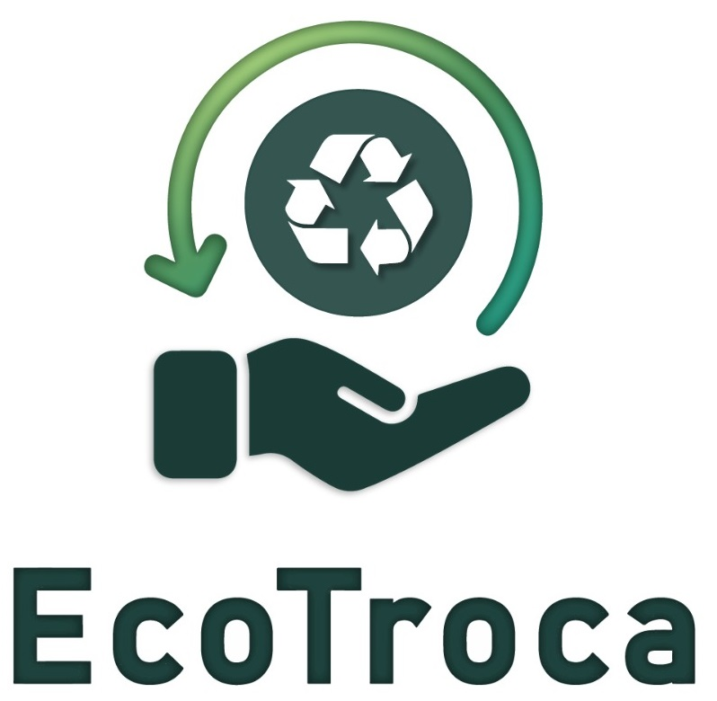

  
  
<strong>EcoTroca: transformando sustentabilidade em recompensas!</strong>

  
  

EcoTroca é um software desktop fantasioso desenvolvido em Java, com propósitos acadêmicos. Ele simula um sistema de recompensas para pessoas que descartam lixo reciclável corretamente nos postos de reciclagem. Basicamente, a pessoa leva seu lixo reciclável até um posto, os funcionários desse posto utilizam o EcoTroca para lançar pontos para essa pessoa e ela poderá trocar esses pontos por diversas recompesas posteriormente, em um cenário fictício que não será abordado neste projeto.

# Tecnologias utilizadas
Para o desenvolvimento desse software, utilizamos as seguintes tecnologias:
* Linguagem Java com JDK.
* IDE NetBeans para edição de código e afins.
* Banco de dados MySQL para persistência de dados.
* StarUML, Diagrams.net e Lucidchart para confecção de diagramas de modelagem do sistema.
* Desenvolvido em sistema operacional Windows 10.

# Como o sistema funciona?
O programa foi desenvolvido para ser utilizado pelos funcionários dos postos de coleta e reciclagem. O próprio funcionário deve realizar o seu cadastro com seus dados pessoais, e aguardar a aprovação de seu acesso por um dos administradores. Quando seu acesso for aprovado, ele poderá utilizar o sistema para cadastrar descartes, pesando os materiais dos cidadãos que o levam, registrando em base de dados e gerando pontuação para eles.

Um usuário com perfil de funcionário, não terá acesso a todas as funcionalidades do sistema, ele está limitado apenas a consultas, como buscar dados de cidadãos cadastrados, registro de novos descartes, cadastro de cidadãos, e coisas do tipo. Ações mais extremas como excluir registros do banco, editar quantos pontos cada material dá para os cidadãos, apenas usuários com perfil de administrador podem realizar.

# Quem desenvolveu esse programa?
Conheça a equipe que modelou e desenvolveu o EcoTroca:

## Equipe de modelagem
| [ Vinicius Gutierrez](https://www.linkedin.com/in/viniciusgutierrezduarte/) | [ Stephany Dantas](https://www.linkedin.com/in/stephany-dantas-508ab222a/) | [ Gabriela Vitoriano](https://www.linkedin.com/in/gabriela-vitoriano-58453b269/) | [ Paloma Lopes](https://www.linkedin.com/in/lspaloma/) |
| :---: | :---: | :---: | :---: |

## Equipe de desenvolvimento
| [ Fernando Fukunaga](https://github.com/fernando-fukunaga) | [ Sara Alves](https://www.linkedin.com/in/sara-alves-79a48224b/) | [ Gabriel Parra](https://www.linkedin.com/in/gabrielparrab/) |
| :---: | :---: | :---: |

# Como rodar esse programa em minha máquina?
Para testar o EcoTroca em sua máquina você precisa ter instalado os seguintes programas:
* Java Development Kit (JDK) versão 19 (se você tiver uma versão diferente, confira a sessão "Configurando o pom.xml").
* IDE NetBeans para rodar o projeto.
* Banco de dados MySQL e MySQL Workbench para o setup do banco.

É importante, também, que você tenha conexão com a internet.

## Fazendo o setup do banco
* Abra o seu workbench e crie uma conexão com localhost, caso ainda não haja uma criada.
* Vá para File > Open SQL Script e selecione o script que está em docs/ecotroca_db_setup_script.sql no nosso projeto.
* Clique no ícone do raio para executar todo o script de uma vez.
* Pronto! você já fez o setup do banco de dados! Ele já terá o usuário admin registrado e mais alguns dados para showcase.

Os dados de login do admin inicial são: 
Login: fernando123 
Senha: senha

## Configurando a ConnectionFactory
* Abra o seu NetBeans e depois abra o projeto.
* Abra a classe ConnectionFactory.java no pacote com.br.ecosolucoes.ecotroca.models.dao
* Apenas altere as variáveis do início conforme a configuração do seu banco MySQL. Por exemplo, seu usuario pode ser diferente de "root", você pode estar usando uma porta diferente de 3306 na sua máquina e também você muito provavelmente configurou uma senha diferente do que apenas "senha" (eu espero que sim XD). Altere essas informações para que se adequem às configurações da sua máquina e evite erros de conexão.
* Pronto, é só salvar o arquivo com Ctrl+S.

## Configurando o pom.xml (se você tem o JDK 19, pule essa parte)
Como descrito nos requisitos, você deve ter a versão 19 da JDK para rodar o programa sem mais problemas. Porém, caso você tenha outra versão, como a 17, por exemplo, ainda dá para rodar, mas você deve configurar o pom.xml:
* Abra o arquivo pom.xml na raíz do projeto
* Edite o valor dentro das tags maven.compiler.source e maven.compiler.target alterando de 19 para a versão de JDK que você tem instalado, como 17, por exemplo
* Pronto, é só salvar o arquivo com Ctrl+S.

## Rodando o projeto
Agora é só clicar em "run file" e você já conseguirá utilizar o nosso software em sua máquina :D

# Documentos interessantes
Na pasta /docs desse projeto, você poderá ver todos os documentos e desenhos que fizeram parte da modelagem do nosso software. Como por exemplo, documento de levantamento de requisitos, diagramas da UML, modelo conceitual de banco de dados, coisas do gênero. Vale a pena conferir!
